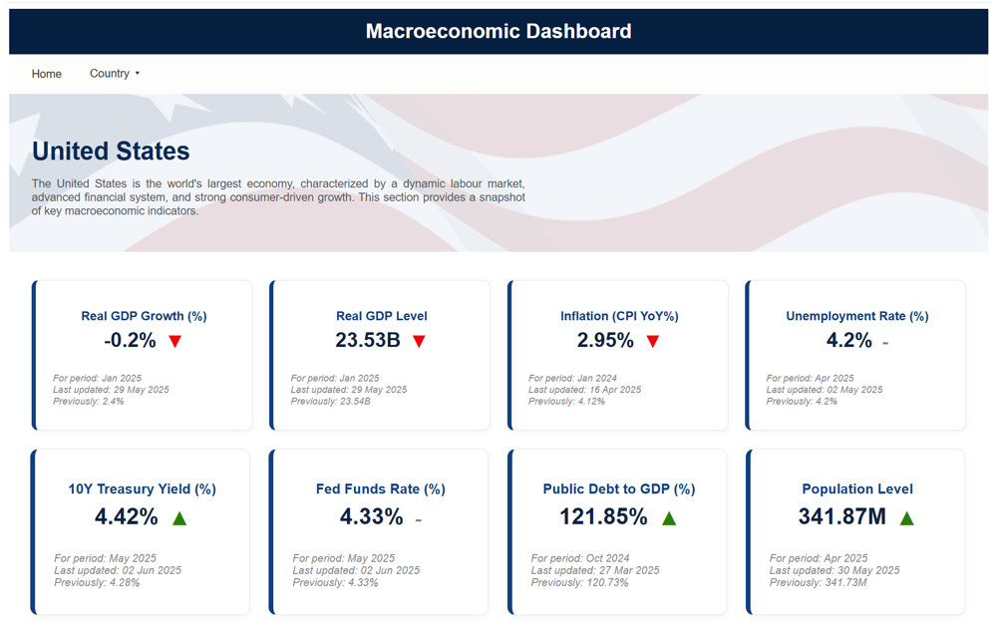

# econ_dashboard
A project to help me learn javascript/ frontend development. The idea is to have a macroeconomic dashboard that pulls data from FREDAPI, processes the data using python and presents the summarised data in an easy to access dashboard. 

## 📸 Screenshots

**US Overview:**

This page displays key macroeconomic indicators sourced from the FRED API. For each variable, it shows the latest and previous values, the direction of change, the reference period, and the most recent update timestamp.



## 🚀 Getting Started

### Prerequisites
- Python 3.10+
- Node.js 18+
- FRED API Key

### Setup
Clone the repository and install dependencies:

```
git clone https://github.com/jsanford-dev/econ_dashboard.git

```

Create a ```.env``` file in your project root with your API key details. An example can be found in ```.env.example.```

```
FRED_API_KEY=your_fred_api_key_here
```

Run th project:

```
python main.py
```

## 🖼 Image Credits
- Flag banner images were sourced from [Freepik](https://www.freepik.com)

🔨 This project is underdevelopement. 🔨
